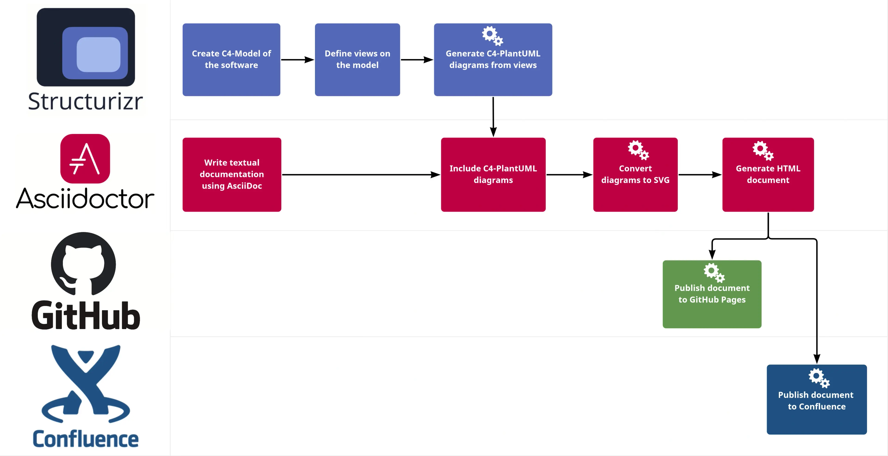

# Documentation Workflow

We learn how to generate and publish HTML architecture documentation from code with Structurizr and Asciidoctor / Markdown.

The goal of this approach is to reduce the efforts for maintaining long-living architecture documentation, keep it up to date, and ensure consistency.

## Motivation

> Teams with good documentation deliver software faster and more reliably than those with poor documentation
> Accelerate State of DevOps Report, Google 2021

As an engineering team, we work with self-organized development teams where architecture documentation is one of the many team responsibilities. Maintaining a consistent and up-to-date architecture documentation can be a challenging and time-consuming task, especially when things change fast and the tooling isn’t appropriate. Disruptive workflows, missing automation and versioning as well as storing the documentation separately from the code are problems often encountered. As a result, architecture documents can become inconsistent and outdated.

To addresses these challenges, aiming to enable teams to create their architecture documentation using the tool they know and like, their IDE. We will combine open-source tools to create a workflow in order to generate architecture documentation from code. The resulting documents will be published to GitHub Pages and Confluence automatically via GitHub Actions.

## Let’s start with a high-level view on this workflow.

At first glance, the workflow shown in the following figure might look complex, but most of the steps are automated (gear icon). This automation has two benefits. First, we can easily adopt and republish the documentation if something changes. Second, we can focus on creating our architecture diagrams and writing the textual description of our system.



We create our architecture diagrams using [Structurizr](). These diagrams and the textual documentation will be combined in an `AsciiDoc` document, which will then be converted to HTML using the Asciidoctor tool chain.

The resulting document can then be published in company wikis or hosted on any website. As an example, we will publish them to GitHub Pages as well as to Atlassian Confluence, allowing non-technical colleagues to access the documentation.

The tools Structurizr and Asciidoctor as well as the markdown language AsciiDoc are at the heart of our workflow. Therefore, let’s have a closer look at them and their underlying concepts.

## Structurizr

Structurizr is a collection of tools allowing us to create architecture diagrams programmatically. The approach of creating diagrams using code is not new. Tools like PlantUML or Mermaid have been around for some years, allowing for writing diagrams in a markup or programming language that can be processed and converted to images. As a result, this enables us to treat our diagrams as code. Thus, we can store them in our version control system together with our code, edit them in our IDE, and use our build pipelines to generate them.

### Diagrams as code 2.0

Taking this approach one step further, Structurizr introduces a single, central model representing the architecture of our system. For this model, we can create multiple views in order to visualize different aspects of our software on different abstraction levels. This separation between model and views has a big benefit. For example, let’s say we would use a diagram as code or drawing tool of our choice to create multiple architecture diagrams. Consequently, if an important aspect of our architecture changes, we would need to align all affected diagrams. This can be time-consuming and error-prone. With Structurizr, we only need to change the central model (DRY principle ). All views based on the model will be updated automatically, making sure they are consistent. To emphasize this advantage compared to other diagrams as code tools, the approach is referred to as diagrams as code 2.0 by the creator of Structurizr, Simon Brown .

### Tooling

The Structurizr diagram below shows the high-level architecture of the Azure Verified Module Hub. The following will install the container on your local machine:

```sh
docker pull ghcr.io/avisi-cloud/structurizr-site-generatr
docker run -it --rm ghcr.io/avisi-cloud/structurizr-site-generatr --help
docker run -it --rm ghcr.io/avisi-cloud/structurizr-site-generatr version
```

With a working installation, we can proceed to generate the diagram:

```sh
docker run -it --rm -v /Users/damianflynn/Developer/DamianFlynn/Azure-Verified-Module-Hub:/var/model ghcr.io/avisi-cloud/structurizr-site-generatr generate-site -w workspace.dsl
```

Now, to develop the site locally, we can use the following command:

```sh
docker run -it --rm -v /Users/damianflynn/Developer/DamianFlynn/Azure-Verified-Module-Hub:/var/model -p 8080:8080 ghcr.io/avisi-cloud/structurizr-site-generatr serve -w workspace.dsl
```
